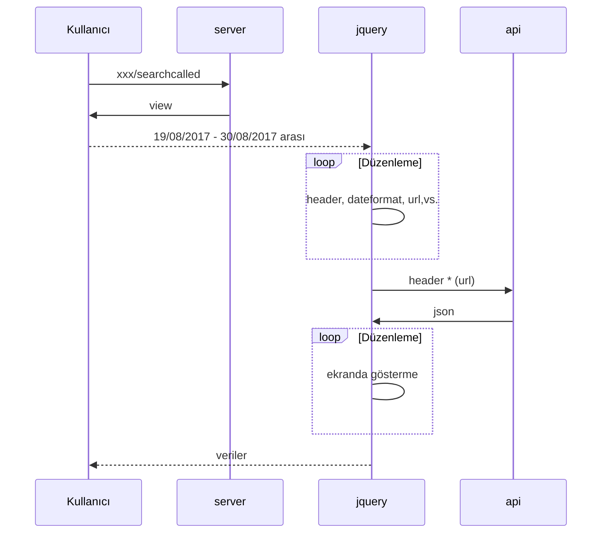

# djangoLevel2!

Bu uygulama önceki uygulamanın üstüne biraz daha farklı bir boyut katıyor.
**Alotech** firmasının yayınlamış olduğu test api üzerinden, iki tarih arasındaki arama kayıtlarını json formatında çekerek, kullanıcıya yayınlıyoruz. Aslında client side ağırlıklı bir proje olduğunu söyleyebiliriz.
|    Kullanılan teknolojler|Sürüm|
|----------------|---------------|
|Python 		 |`3.6.5`        |   
|Django			 |`2.7`          |
|Jquery          |`3.3.1`        |
|Bootstrap		 |`4.1`          |

### Yayınlama 
Google Cloud üzerinden yayınlama yapmam istendi. Google Cloud ile ilgili teknik bir dökümanı yakın bir zamanda [ArzveSu](https://arzvesu.blogspot.com) bloğumda paylaşmayı düşünüyorum.

## Hızlı Kodlar
`sudo apt-get update` 
`sudo apt-get install nginx` 
`sudo systemctl start nginx` 
`sudo apt-get install python3-pip` 
`python --version` 
`pip install Django` 
`git clone djangoBeginnerApp`   
`python3 -m venv`
`myvenv source myvenv/bin/activate`
`./python manage.py runserver 0.0.0.0:8000`

## UML diagrams

You can render UML diagrams using [Mermaid](https://mermaidjs.github.io/). For example, this will produce a sequence diagram:

_Kalın çizgiler: Dış Bağlantı_
_Kesikli çizgiler: İç Bağlantı_

