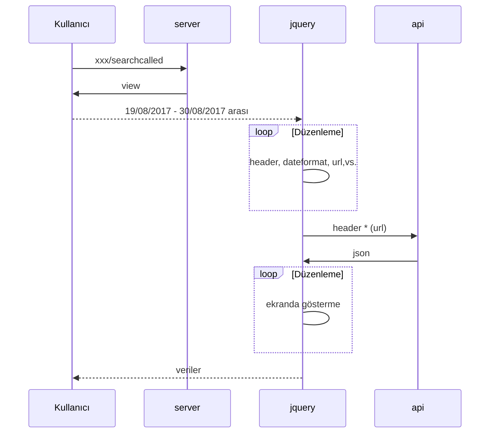

# djangoLevel2! 
_[fatihcankeser.herokuapp.com/searchcalled/](https://fatihcankeser.herokuapp.com/searchcalled/)!Haliyle izinler yok ve yakın zamanda http bağlantıları google chrome güvensiz olarak işaretledi. Apiye bağlanırken arkaplanda ajax ile http isteği yolluyorum güvensiz gözükmesine aldanmayınız Sağ üstteki kutucuktan  izin vermeyi unutmayın ._

Bu uygulama önceki uygulamanın üstüne biraz daha farklı bir boyut katıyor.
**Alotech** firmasının yayınlamış olduğu test api üzerinden, iki tarih arasındaki arama kayıtlarını json formatında çekerek, kullanıcıya yayınlıyoruz. Aslında client side ağırlıklı bir proje olduğunu söyleyebiliriz.
                    

                    
Kullanılan teknolojler  | Sürüm
------------- | -------------
Python  | `3.6.5`
Django  | `2.7`
Jquery  | `3.3.1` 
Bootstrap  | `4.1`        

### Yayınlama 
Google Cloud üzerinden yayınlama yapmam istendi. Google Cloud ile ilgili teknik bir dökümanı yakın bir zamanda 
[ArzveSu](https://arzvesu.blogspot.com) bloğumda paylaşmayı düşünüyorum.
 

## Hızlı Kodlar
- `sudo apt-get update` 
- `sudo apt-get install nginx` 
- `sudo systemctl start nginx` 
- `sudo apt-get install python3-pip` 
- `python --version` 
- `pip install Django` 
- `git clone djangoBeginnerApp`   
- `python3 -m venv`
- `myvenv source myvenv/bin/activate`
- `./python manage.py runserver 0.0.0.0:8000`

## UML diagrams

Bunun için biraz uğraşmak gerekli tabii[Mermaid](https://mermaidjs.github.io/). Siteye bunu yapıştırabilirsiniz.

_Kalın çizgiler: Dış Bağlantı_
_Kesikli çizgiler: İç Bağlantı_

